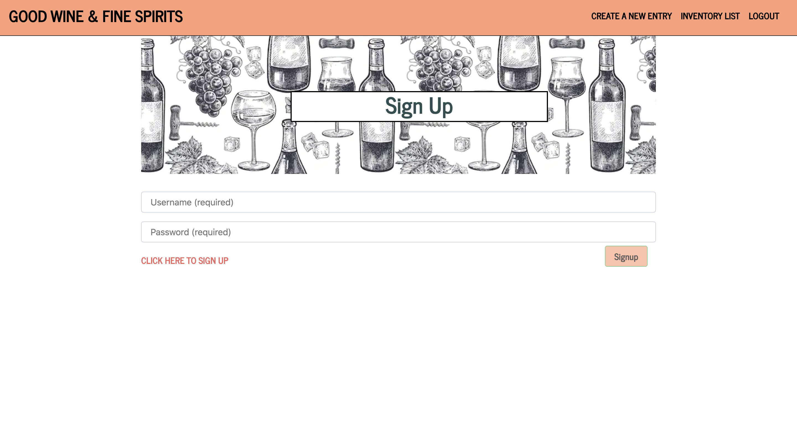
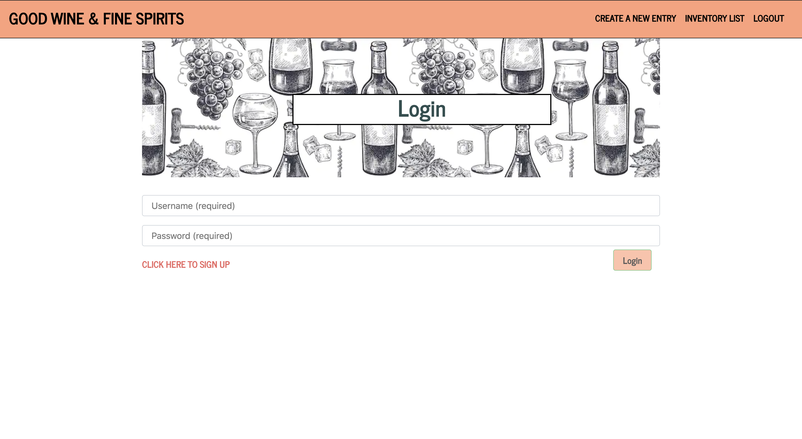
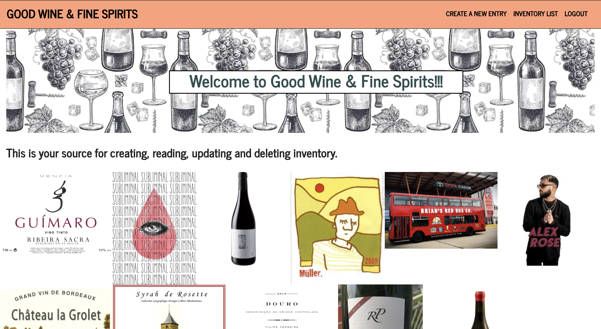
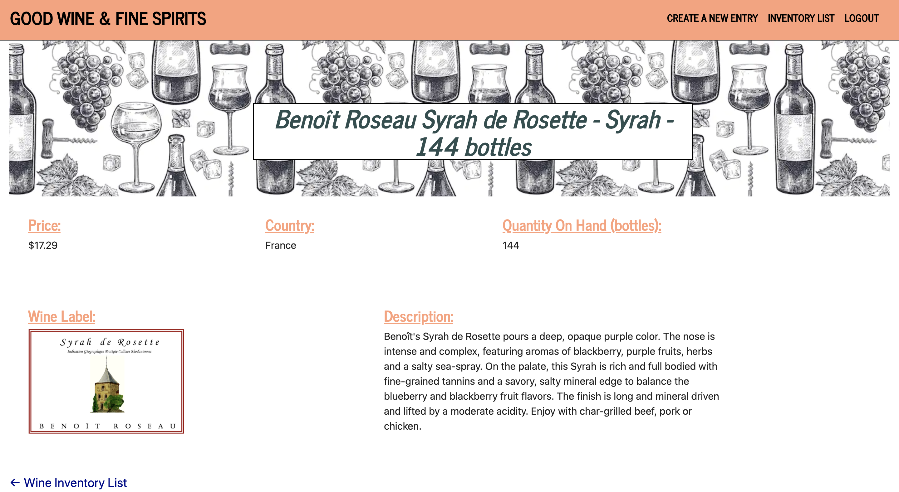
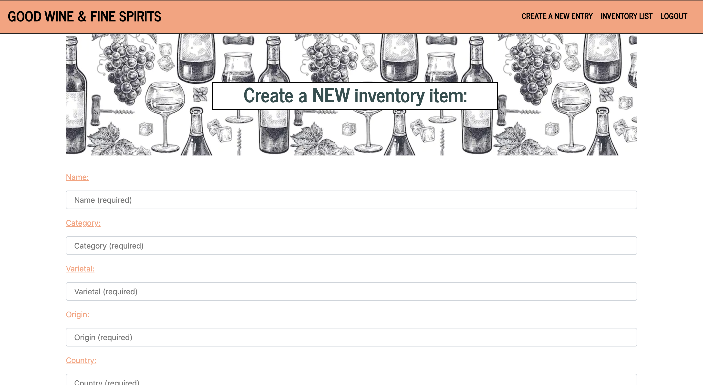
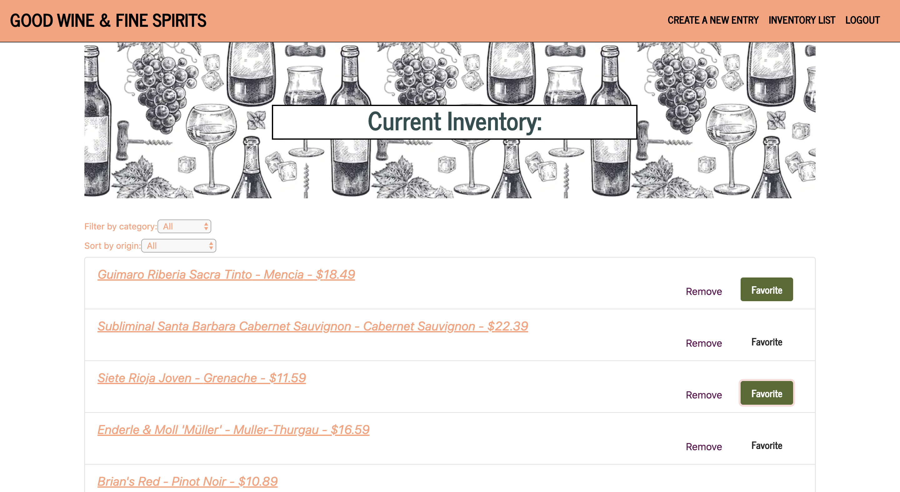

# Project-3

Good Wine and Fine Spirits

## Description
<<<<<<< HEAD

This tool allows you to manage your inventory on hand, add new inventory, sort existing inventory as well as filter by category. It is designed to organize your logistically needs. 

## Visuals

//will hold final screen shots of app
=======
The idea began with the PLCB shutdown and how cool it would be to create a website that was an ecommerce platform with client function separate from employee functions. From there we chose to begin with an inventory management system.

This tool allows you to manage your inventory on hand, add new inventory, sort existing inventory and filter products by category. This is designed to organize your logistical needs. 

## Visuals

>>>>>>> 887a1d0866183f001a914cf34a6516e66ca80893

## Usage
<strong>AS</strong> a logistics manager, <strong>I WANT</strong> to control my inventory system, <strong>SO THAT</strong> my business can run successfully.

## Authors and acknowledgment

Alexander Korjeski, Brian Prickril and Jarrod Finn

## Contributing

Pull requests are welcome. For major changes, please open an issue first to discuss what you would like to change.

Please make sure to update tests as appropriate.
